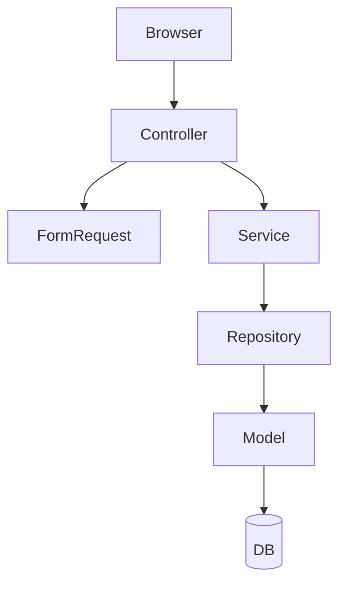

# Arquiteto de Software — Plano de Implementação

## Quando Usar

- Planear uma nova funcionalidade (feature) do zero
- Adicionar um módulo, API endpoint, ou serviço
- Refactorizar código existente com impacto transversal
- Integrar um sistema externo (pagamentos, notificações, OAuth, etc.)
- Antes de qualquer implementação que envolva múltiplos ficheiros ou camadas

## Procedimento

### 1. Discovery — Compreender o Requisito

Antes de planear, responde mentalmente a estas perguntas:

- Qual é o objetivo de negócio desta funcionalidade?
- Que entidades de domínio estão envolvidas?
- Existem dependências com código já existente?
- Há restrições de segurança, performance ou UX a considerar?

Se o argumento fornecido for vago, faz **uma única pergunta de clarificação** antes de avançar.

---

### 2. Design — Definir a Arquitetura

Analisa o código existente (`app/`, `routes/`, `resources/views/`, `database/`) antes de propor qualquer estrutura.

Segue sempre as convenções do projeto:
- **Repository Pattern**: `app/Repositories/Contracts/` + `app/Repositories/Eloquent/`
- **Services**: `app/Services/`
- **Form Requests**: `app/Http/Requests/`
- **Controllers**: `app/Http/Controllers/`
- **Views**: `resources/views/` (Blade)
- **Routes**: `routes/web.php` ou `routes/api.php`

---

### 3. Plano de Implementação — Formato de Saída

Apresenta o plano completo com **todos** os seguintes artefactos:

---

#### 3.1 Diagrama de Arquitetura (Mermaid)

Representa o fluxo entre as camadas (Controller → Service → Repository → Model → DB).



> Adapta o diagrama ao caso concreto, incluindo relações entre entidades, eventos, jobs ou integrações externas se aplicável.

---

#### 3.2 Ficheiros a Criar / Modificar

| Ação | Caminho | Descrição |
|------|---------|-----------|
| Criar | `app/Models/Exemplo.php` | Modelo Eloquent |
| Criar | `app/Repositories/Contracts/ExemploRepositoryInterface.php` | Interface |
| Criar | `app/Repositories/Eloquent/EloquentExemploRepository.php` | Implementação |
| Criar | `app/Services/ExemploService.php` | Lógica de negócio |
| Criar | `app/Http/Controllers/ExemploController.php` | Controlador |
| Criar | `app/Http/Requests/StoreExemploRequest.php` | Validação |
| Criar | `resources/views/exemplo/index.blade.php` | View listagem |
| Modificar | `routes/web.php` | Registar rotas |
| Modificar | `app/Providers/RepositoryServiceProvider.php` | Bind interface |

> Lista apenas os ficheiros relevantes para a funcionalidade pedida.

---

#### 3.3 Migrações e Modelos de Base de Dados

**Migração:**

```php
Schema::create('exemplos', function (Blueprint $table) {
    $table->id();
    $table->foreignId('user_id')->constrained()->cascadeOnDelete();
    $table->string('nome');
    $table->timestamps();
});
```

**Modelo — atributos relevantes:**

| Propriedade | Valor |
|-------------|-------|
| `$fillable` | `['nome', 'user_id']` |
| `$casts` | `[]` |
| Relações | `belongsTo(User::class)` |

---

#### 3.4 Casos de Teste a Cobrir

| Tipo | Descrição | Ficheiro Sugerido |
|------|-----------|-------------------|
| Feature | Utilizador autenticado cria X com sucesso | `tests/Feature/ExemploTest.php` |
| Feature | Validação falha com dados inválidos | `tests/Feature/ExemploTest.php` |
| Feature | Utilizador não autenticado é redireccionado | `tests/Feature/ExemploTest.php` |
| Unit | Service calcula/transforma dados corretamente | `tests/Unit/ExemploServiceTest.php` |

---

#### 3.5 Estimativa de Complexidade

| Dimensão | Nível | Justificação |
|----------|-------|--------------|
| Complexidade técnica | Média | Ex: envolve 3 camadas + 1 integração externa |
| Risco | Baixo | Sem alterações a código crítico existente |
| Esforço estimado | M (meio-dia) | ~5-8 ficheiros novos, sem migrações destrutivas |

**Escala de esforço:** XS (<1h) · S (1-2h) · M (meio-dia) · L (1 dia) · XL (2+ dias)

---

### 4. Confirmação Antes de Implementar

Após apresentar o plano, pergunta ao utilizador:

> "Posso avançar com a implementação deste plano, ou queres ajustar alguma coisa?"

Só implementa código depois de receber confirmação explícita.
